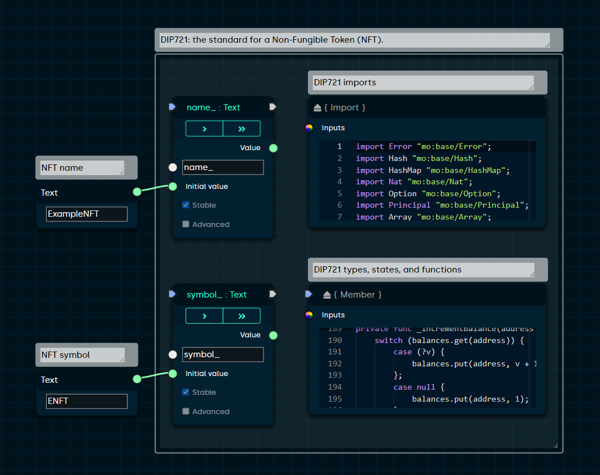

## Getting Started

Here are a few tips for learning the Gitshock Edgeware user interface:

- Complete the [interactive tutorials](https://openware.gitshock.com/tutorials) to learn the basic editor workflow.
- Browse a variety of [examples and templates](https://blocks-editor.github.io/blocks/?menu=load) available in the application.
- Select a block and press 'Q' on your keyboard to view the corresponding [Quick Reference](https://blocks-editor.github.io/blocks/?menu=reference) information. 
- Try hovering your mouse over a block name, connection socket, or input field to view a tooltip with more context.
- Open the 'Compile' panel and press 'Build & Run' to compile, deploy and test your code on the Internet Computer. 
- If you're running into an issue or have any questions, feel free to ask our [Discord community](https://discord.gg/jDDWtKwWQf)!

---



> Combine visual logic with Motoko language syntax using custom Expression blocks. 

## Advanced Usage

- Customize the editor and view keyboard shortcuts for common block types in the [Options](https://github.com/gitshock-labs/Drag-And-Drop-SmartSC-Edgeware) menu.
- Hold 'Ctrl' or 'Cmd' when opening the right-click placement menu to view and search all blocks available in the editor. 
- Quickly remove connections by holding the 'Ctrl' or 'Cmd' key and clicking on a connection socket.
- Add a GitHub library using a `Package` block, import a file using an `Import` block, and call a library function using an expression block such as `{ Expression }` or `{ Statement }`.
- Add test cases to ensure your smart contract works as intended.

## Local Environment

```sh
git clone 
cd blocks
npm install
```

### Serve (http://localhost:3000):

```bash
npm start
```

### Test:

```bash
npm test
```

### Build:

```bash
npm run build
```